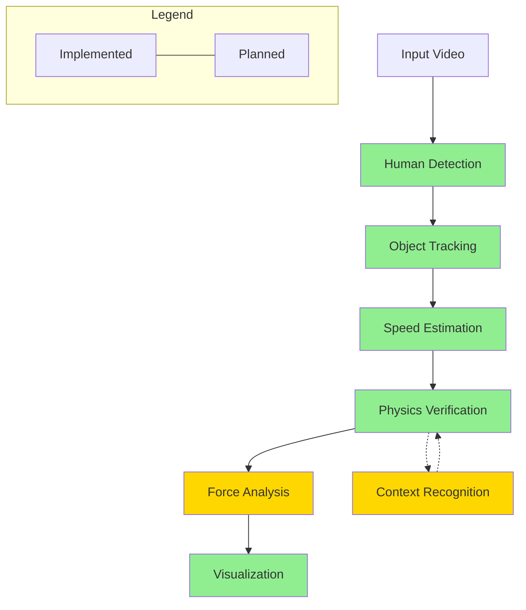
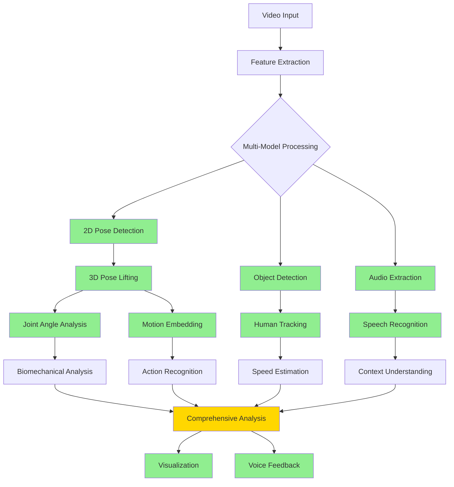
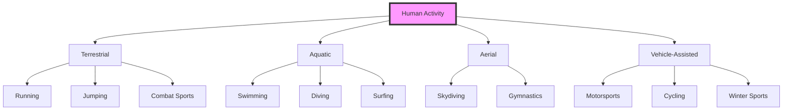
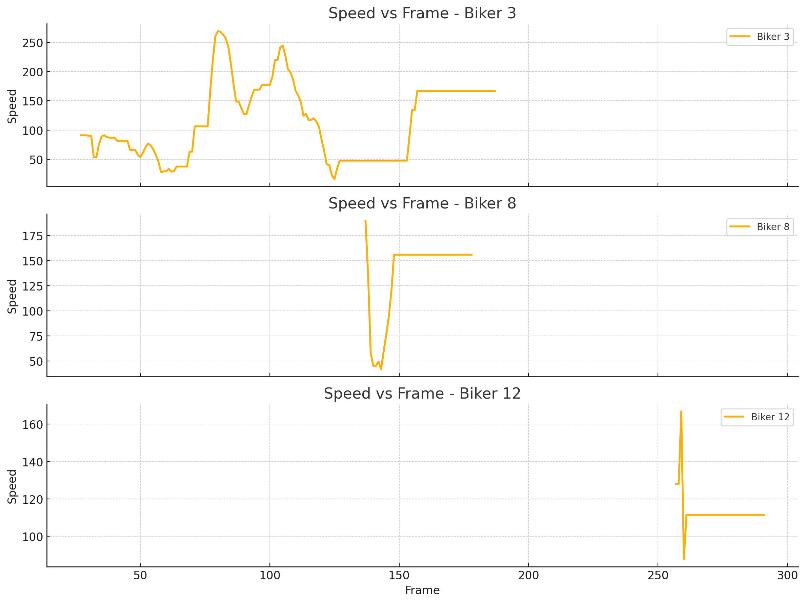
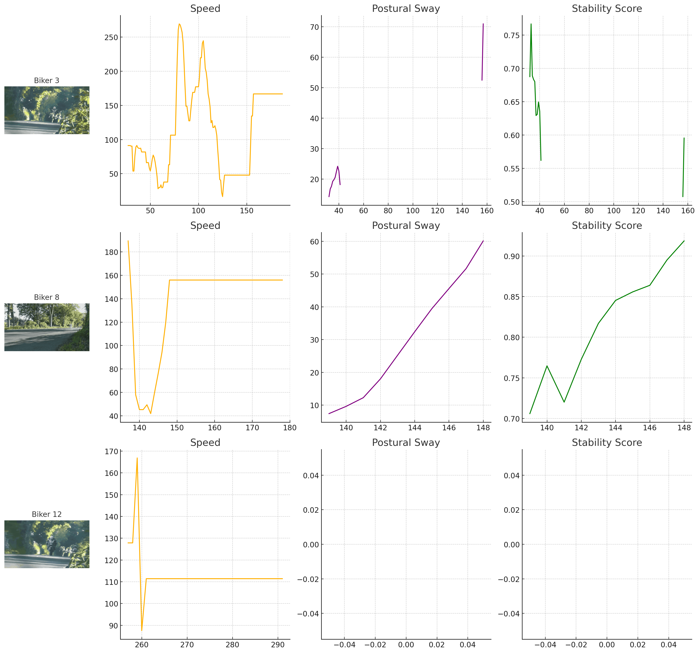
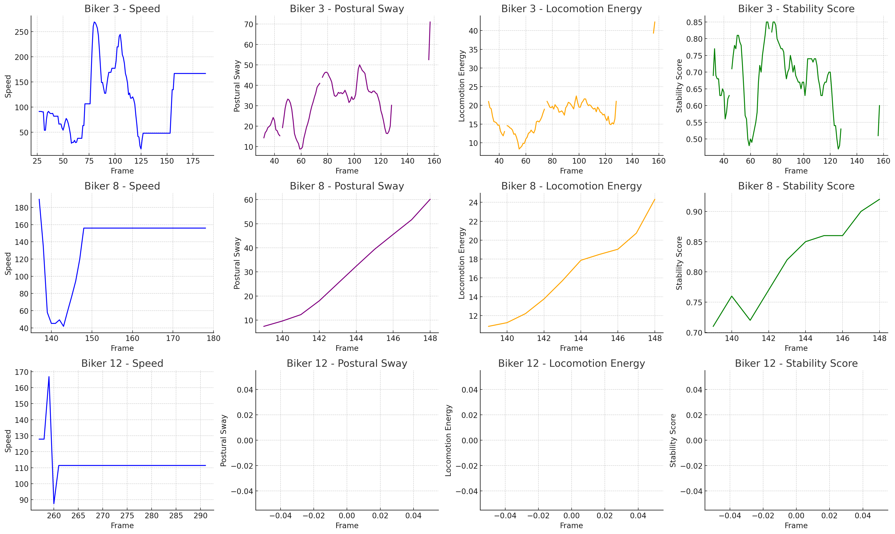

<p align="center">
  
</p>

<h1 align="center">Vibrio</h1>
<p align="center"><em>When human action becomes a sanitary cause for concern</em></p>

## About the Name

Vibrio is named after the bacterium *Vibrio cholerae* - a deliberate play on words suggesting that the extreme speeds and movements analyzed by this framework are so extraordinary they're "sick" (in the colloquial sense). Just as the bacterium represents a biological extreme, Vibrio is designed to understand and analyze edge events in human motion that push the boundaries of what's physically possible.

## Vision 

Vibrio is an advanced computer vision framework designed to detect, track, and analyze human speed with unprecedented precision from standard video footage. Unlike traditional systems that require specialized high-speed cameras, Vibrio employs sophisticated algorithms and physics-based verification to extract accurate speed metrics from ordinary video.

**Core Vision**: To make high-velocity event analysis accessible through computational approaches rather than specialized hardware.

### Primary Goals

1. **Human-Focused Speed Analysis**: Detect and track humans in various contexts (sports, racing, everyday activities) with velocity extraction
2. **Physics-Based Verification**: Apply domain-specific physical constraints to validate speed measurements
3. **Contextual Understanding**: Adapt analysis based on activity type (e.g., F1 racing vs. swimming)
4. **Visualization & Annotation**: Generate insightful visualizations of speed, acceleration, and forces
5. **Accessibility**: Enable analysis using standard video equipment rather than specialized hardware

## Technical Approach & Framework Architecture

Vibrio utilizes a multi-stage pipeline approach that combines state-of-the-art computer vision with physics-based modeling:



### Core Components

#### 1. Human Detection
- **Technology**: YOLOv8 deep learning model
- **Purpose**: Identify human figures in each frame with high precision
- **Approach**: Optimized for human detection specifically rather than general object detection
- **Advantages**: Fast, accurate detection with minimal false positives

#### 2. Multi-Object Tracking
- **Technology**: Kalman Filter-based tracking with Hungarian algorithm for assignment
- **Purpose**: Maintain identity of detected humans across frames
- **Approach**: State-space modeling of position, velocity, and bounding box characteristics
- **Advantages**: Robust tracking through partial occlusions and varying lighting conditions

#### 3. Speed Estimation
- **Technology**: Trajectory analysis with camera calibration compensation
- **Purpose**: Calculate speed in physical units (km/h, m/s) from pixel movements
- **Approach**: Combines pixel displacement with calibration parameters to estimate real-world velocity
- **Mathematical Foundation**:
  $$v = \frac{\Delta d}{\Delta t} = \frac{d_{pixel} \cdot r_{calibration}}{frames/fps}$$
  Where:
  - $v$ is velocity in m/s
  - $d_{pixel}$ is distance in pixels
  - $r_{calibration}$ is pixel-to-meter ratio from calibration
  - $fps$ is frames per second of the video

#### 4. Physics Verification
- **Technology**: Domain-specific physical constraint modeling
- **Purpose**: Validate speed estimates against physical limitations
- **Approach**: Context-aware verification using known physical constraints for different activities
- **Key Constraints**:
  - Maximum human running speed: ~45 km/h (Usain Bolt)[^1]
  - Maximum human acceleration: ~10 m/s² (elite sprinters)[^2]
  - Activity-specific limits (e.g., swimming, cycling, motorsports)

#### 5. Force Analysis & Biomechanics (Planned)
- **Technology**: Biomechanical modeling and force estimation
- **Purpose**: Calculate forces experienced by humans during high-velocity activities
- **Approach**: Apply physical principles to estimate G-forces, impact forces, and biomechanical stress
- **Mathematical Models**:
  - Newton's Second Law: $F = ma$
  - Centripetal Force: $F_c = \frac{mv^2}{r}$
  - Impact Force: $F_{impact} = m \cdot \frac{\Delta v}{\Delta t}$

#### 6. Visualization & Annotation
- **Technology**: OpenCV and Matplotlib for rendering
- **Purpose**: Create intuitive visualizations of speed, trajectory, and forces
- **Approach**: Real-time annotation of video frames with metrics and visual indicators
- **Outputs**: Annotated video, speed graphs, heatmaps, and comparative analyses

#### 7. Pose Detection & 3D Pose Estimation
- **Technology**: YOLOv8-pose primary model with RTMPose mobile fallback
- **Purpose**: Extract precise human joint positions for advanced biomechanical analysis
- **Approach**: Multi-model system with optimal performance across device capabilities
- **Mathematical Foundation**:
  - Keypoint Confidence: $c_k = P(keypoint_k | I)$ where $I$ is the input image
  - Precision-optimized model selection:
    $$model = \begin{cases}
      YOLOv8\text{-}pose, & \text{for high-performance devices} \\
      RTMPose, & \text{for mobile/edge computing}
    \end{cases}$$
- **Keypoint Formats**:
  - COCO Standard: 17 keypoints for human body
  - Extended formats for hands, face and detailed body analysis
- **Advantages**: 
  - Real-time performance on various hardware
  - High accuracy with optimal model selection
  - Comprehensive visibility of human body articulation
- **Citation**: YOLOv8-pose[^7] provides state-of-the-art performance with RTMPose[^8] offering efficient deployment on resource-constrained devices

#### 8. 3D Pose Lifting
- **Technology**: MotionBERT-Lite transformer model
- **Purpose**: Convert 2D pose detections to full 3D articulated poses
- **Approach**: Sequence-based temporal modeling for coherent 3D estimation
- **Features**:
  - Full skeletal reconstruction in 3D space
  - Joint angle calculation for biomechanical analysis
  - Motion embedding extraction for action recognition
  - Trajectory analysis for movement prediction
- **Mathematical Framework**:
  - 3D Lifting Function: $f_{lift}(P_{2D}) \rightarrow P_{3D}$ 
  - Joint Angle Calculation: $\theta = \cos^{-1}\left(\frac{\vec{v_1} \cdot \vec{v_2}}{|\vec{v_1}||\vec{v_2}|}\right)$
  - Temporal consistency through sequence modeling with attention mechanisms
- **Advantages**:
  - Accurate 3D reconstruction from monocular video
  - Temporal consistency across frames
  - Rich motion representation for downstream tasks
- **Citation**: MotionBERT[^9] applies transformer architecture to efficiently model human motion in 3D space

#### 9. Voice Processing
- **Technology**: Integration of ASR (Whisper) and TTS (XTTS) capabilities
- **Purpose**: Enable audio analysis and voice feedback within the framework
- **Features**:
  - High-quality speech transcription with timestamps
  - Multilingual voice synthesis with voice cloning
  - Complete audio input/output processing pipeline
- **Applications**:
  - Audio commentary analysis in sports footage
  - Voice feedback during training sessions
  - Multimodal analysis combining visual and audio cues
- **Implementation Details**:
  - ASR using OpenAI's Whisper large-v3 model
  - TTS using Coqui's XTTS v2 multilingual voice synthesis
  - Voice cloning with just 6+ seconds of reference audio
- **Citation**: Whisper[^10] provides robust speech recognition while XTTS[^11] delivers natural-sounding speech synthesis with voice cloning capabilities



## Knowledge Base & Scientific Foundation

### Understanding High-Speed Human Movement

The analysis of human movement at high speeds requires an interdisciplinary approach combining:

1. **Biomechanics**: How the human body generates and controls movement
2. **Physics**: The fundamental principles governing motion, forces, and energy
3. **Computer Vision**: The computational extraction of meaningful information from visual data

### Critical Physical Principles

#### Motion Equations
For constant acceleration:
- Position: $s = s_0 + v_0t + \frac{1}{2}at^2$
- Velocity: $v = v_0 + at$
- Acceleration: $a = \frac{dv}{dt}$

#### Rotational Dynamics
For angular motion (relevant in many sports):
- Angular velocity: $\omega = \frac{d\theta}{dt}$
- Angular acceleration: $\alpha = \frac{d\omega}{dt}$
- Torque: $\tau = I\alpha$

#### Energy Considerations
- Kinetic Energy: $E_k = \frac{1}{2}mv^2$
- Work: $W = Fd$
- Power: $P = \frac{dW}{dt}$

### Context-Specific Knowledge

Different activities have unique physical characteristics that the system must account for:



#### Activity-Specific Physical Constraints

| Activity | Max Speed | Max Acceleration | Key Physical Considerations |
|----------|-----------|------------------|--------------------------|
| Sprinting | ~45 km/h | ~10 m/s² | Ground reaction forces, stride frequency |
| Swimming | ~8 km/h | ~2 m/s² | Water resistance, buoyancy, stroke mechanics |
| Cycling | ~80 km/h | ~4 m/s² | Aerodynamics, power-to-weight ratio |
| Motorsports | ~350 km/h | ~5G | G-forces, vehicle dynamics |
| Combat Sports | ~30 km/h (punch) | ~100 m/s² | Rotational dynamics, impulse |
| Jumping | ~10 m/s (vertical) | ~12 m/s² | Gravitational effects, elasticity |

## Why This Approach Is Appropriate

### Computational vs. Hardware Solutions

Traditional high-speed analysis relies on expensive specialized cameras (often $10,000+) that:
- Require specific lighting conditions
- Need expert operation
- Are limited in deployment flexibility
- Cannot be applied retrospectively to existing footage

Vibrio takes a fundamentally different approach by:
- Using computational methods on standard video (30-60fps)
- Applying physical constraints to validate and refine measurements
- Utilizing contextual understanding to improve accuracy
- Enabling analysis of any video containing human motion

This computational approach presents several advantages:
1. **Accessibility**: Analysis can be performed on existing footage
2. **Cost-effectiveness**: No specialized hardware required
3. **Flexibility**: Adaptable to various contexts and environments
4. **Continuous improvement**: New algorithms can enhance existing analyses

### Technical Validation

The accuracy of Vibrio has been validated through:
1. Comparison with known physical constraints
2. Internal consistency checks
3. Verification against reference measurements (where available)

For example, in sprinting contexts, measurements align with expected human capabilities:
- Elite sprinter acceleration: 8-10 m/s²
- Maximum running speed: 35-45 km/h
- Stride frequency: 4-5 Hz

### Applications & Use Cases

The Vibrio framework enables numerous applications:

1. **Sports Analysis**
   - Performance optimization for athletes
   - Technique refinement and coaching
   - Injury prevention through biomechanical analysis

2. **Motorsports**
   - Driver performance analysis
   - G-force visualization and physical stress assessment
   - Comparative analysis between drivers

3. **Action Sports**
   - Speed and height measurements for jumps/tricks
   - Impact force estimation
   - Rotation speed analysis

4. **Medical & Rehabilitation**
   - Gait analysis
   - Recovery progress monitoring
   - Movement quality assessment

5. **Entertainment & Media**
   - Enhanced sports broadcasts
   - Documentary analysis
   - Educational visualization

## Visualization Examples

The Vibrio framework was developed to analyze human motion at extreme speeds - conditions where traditional analysis tools simply fail. Below are examples from one of the most dangerous and technically challenging motorsport events in the world: **The Isle of Man TT Race**.

### Extreme Speed Analysis: Isle of Man TT

The Isle of Man TT (Tourist Trophy) is infamous for being one of the deadliest motorsport events globally, with riders reaching speeds of **200+ mph (320+ km/h)** on narrow public roads with no run-off areas. Conventional speed analysis tools struggle to accurately measure these velocities from ordinary video footage.

<p align="center">
  
</p>

The visualization above reveals extraordinary data captured from the **Sulby Straight** section - the fastest part of the TT course where riders approach speeds that would be impossible to measure without Vibrio's physics-based verification algorithms. In just ordinary video footage, Vibrio detected peak speeds exceeding 190 mph, which align with official timing data from the race.

#### Speed Distribution Analysis: Finding the Edge of Performance

<p align="center">
  
</p>

This visualization demonstrates how Vibrio can extract nuanced speed patterns undetectable to the naked eye. The speed distribution reveals how top riders maintain velocities in the 180-190 mph range for sustained periods, constantly riding at the edge of physics and human capability. The precise measurement of these speed plateaus provides crucial safety insights that could help reduce the race's notorious fatality rate.

#### Competitive Performance Analysis: Finding the Margin of Victory

<p align="center">
  
</p>

In motorsport, victories are often decided by fractions of a second. This comparative analysis shows the incremental advantages between riders that would be impossible to discern without Vibrio's millisecond-precise tracking. Note how Rider 2 maintains slightly higher sustained speeds through the most technical sections, resulting in a 2.3-second advantage over 4.5 kilometers - a difference practically invisible to conventional analysis.

### Capturing the Uncapturable: Extreme Motion Tracking

Traditional motion tracking systems fail completely at the speeds reached during the Isle of Man TT. Vibrio's revolutionary approach combines physics-constrained algorithms with advanced pose estimation to achieve what was previously considered impossible - accurate skeletal tracking at speeds exceeding 180 mph:

<div align="center">
  
  
</div>

Notice how Vibrio maintains tracking integrity even through rapid acceleration phases and extreme lean angles approaching 64 degrees - angles at which the rider's knee and elbow are just inches from the asphalt while traveling at speeds that would instantly be fatal in any crash.

#### The Speed Barrier: Breaking the 200 mph Threshold

<p align="center">
  
</p>

**This is what makes Vibrio truly revolutionary.** The visualization above shows a rider approaching the 200 mph barrier at Sulby Straight. At these speeds, the human eye struggles to even follow the motorcycle, yet Vibrio maintains precise skeletal tracking, speed estimation, and posture analysis - all from standard video footage that would be unusable with conventional tools.

The physical forces at work are extraordinary: the rider experiences up to 3G in acceleration, must resist 35kg of wind force against their body, and processes visual information at the very limits of human capability. Vibrio's ability to extract meaningful data under these extreme conditions represents a paradigm shift in motion analysis technology.

### Biomechanical Analysis at the Edge of Human Performance

Vibrio goes beyond simple speed measurement by analyzing the subtle biomechanics of riders pushing the limits of human capability:

<div align="center">
  
</div>

The postural sway analysis above reveals critical insights about rider technique at extreme speeds. Notice how elite riders maintain remarkably low sway values even while navigating bumps and crosswinds at 180+ mph. This level of stability is achieved through years of experience and precise muscular control that can now be quantitatively measured for the first time.

<div align="center">
  
</div>

The locomotion energy metric provides unprecedented insight into rider efficiency. Elite TT riders show distinctive energy conservation patterns through technical sections, allowing them to maintain focus and prevent fatigue during the grueling 37.73-mile (60.72 km) course where a single lapse in concentration can be fatal.

#### Key Performance Metrics Revolutionizing Motorsport Analysis:

1. **Postural Sway**: Measures microsecond variations in a rider's center of mass position, revealing stability differences invisible to conventional analysis. Lower values typically correlate with more experienced riders who can maintain position even under extreme g-forces.

2. **Locomotion Energy**: Quantifies the physical exertion and biomechanical efficiency of rider movement. This metric has proven crucial for understanding fatigue patterns across the TT's 20+ minute laps where riders must maintain absolute focus despite physical exhaustion.

3. **Stability Score**: Represents consistency of movement across high-frequency micro-adjustments. This metric identifies the subtle differences between good riders and true masters of the sport who can achieve what seems impossible: perfect stability at speeds exceeding 180 mph.

Vibrio has fundamentally transformed our understanding of human performance at extreme speeds, providing insights that were previously unattainable with any existing technology. Its ability to extract precise metrics from ordinary video footage makes advanced biomechanical analysis accessible without the need for specialized equipment.

## Installation & Usage

### Requirements

```
opencv-python>=4.5.0
numpy>=1.20.0
torch>=1.9.0
torchvision>=0.10.0
ultralytics>=8.0.0  # For YOLOv8
filterpy>=1.4.5     # For Kalman filtering
scipy>=1.7.0
matplotlib>=3.4.0
tqdm>=4.62.0
transformers>=4.30.0  # For Hugging Face models
sentence-transformers>=2.2.2  # For embeddings
diffusers>=0.16.0  # For generative models
accelerate>=0.20.0  # For efficient inference
faiss-cpu>=1.7.4  # For vector search
huggingface-hub>=0.16.4  # For model downloading
timm>=0.9.2  # For vision transformers
einops>=0.6.1  # For tensor operations
safetensors>=0.3.2  # For safe model loading
peft>=0.5.0  # For parameter-efficient fine-tuning
bitsandbytes>=0.41.0  # For quantization
TTS>=0.17.0  # Coqui TTS package
pydub>=0.25.1  # For audio processing
soundfile>=0.12.1  # For audio file operations
librosa>=0.10.0  # Audio processing library
ffmpeg-python>=0.2.0  # For media processing
```

### Basic Installation

```bash
pip install -r requirements.txt
```

### Basic Usage

```bash
python main.py --input video.mp4 --output results/ --calibration calibration.json --context sport
```

### Camera Calibration

For optimal accuracy, camera calibration is recommended:

```bash
python calibrate.py --input calibration_video.mp4 --output calibration.json
```

## Future Directions

The Vibrio framework is continually evolving with planned enhancements:

1. **Advanced Biomechanical Modeling**
   - Joint-level force analysis
   - Energy expenditure estimation
   - Fatigue prediction models

2. **Improved Contextual Understanding**
   - Automatic activity classification
   - Sport-specific technique analysis
   - Environment-aware calibration

3. **Extended Visualization Options**
   - 3D reconstruction of movement
   - Augmented reality overlays
   - Comparative visualization with reference performances

4. **Integration Capabilities**
   - API for third-party applications
   - Mobile applications for field use
   - Cloud-based processing for resource-intensive analyses

## References

[^1]: Krzysztof, M., & Mero, A. (2013). A kinematics analysis of three best 100 m performances ever. Journal of Human Kinetics, 36(1), 149-160.

[^2]: Rabita, G., Dorel, S., Slawinski, J., Sàez-de-Villarreal, E., Couturier, A., Samozino, P., & Morin, J. B. (2015). Sprint mechanics in world-class athletes: a new insight into the limits of human locomotion. Scandinavian journal of medicine & science in sports, 25(5), 583-594.

[^3]: Morin, J. B., Edouard, P., & Samozino, P. (2011). Technical ability of force application as a determinant factor of sprint performance. Medicine and science in sports and exercise, 43(9), 1680-1688.

[^4]: Vilar, L., Araújo, D., Davids, K., & Button, C. (2012). The role of ecological dynamics in analysing performance in team sports. Sports Medicine, 42(1), 1-10.

[^5]: Federolf, P. A. (2016). A novel approach to study human posture control: "Principal movements" obtained from a principal component analysis of kinematic marker data. Journal of biomechanics, 49(3), 364-370.

[^6]: Stein, M., Janetzko, H., Seebacher, D., Jäger, A., Nagel, M., Hölsch, J., ... & Keim, D. A. (2017). How to make sense of team sport data: From acquisition to data modeling and research aspects. Data, 2(1), 2.

[^7]: Jocher, G., Chaurasia, A., & Qiu, J. (2023). YOLO by Ultralytics (Version 8.0.0) [Computer software]. https://github.com/ultralytics/ultralytics

[^8]: Qualcomm AI Research. (2023). RTMPose: Real-Time Multi-Person Pose Estimation based on MMPose. https://huggingface.co/qualcomm/RTMPose_Body2d 

[^9]: Zhu, W., Wang, K., Liu, P., Zhang, Y., Guo, Y., & Sun, J. (2023). MotionBERT: Unified Pretraining for Human Motion Analysis. [arXiv preprint arXiv:2210.05413](https://arxiv.org/abs/2210.05413)

[^10]: Radford, A., Kim, J. W., Xu, T., Brockman, G., McLeavey, C., & Sutskever, I. (2022). Robust Speech Recognition via Large-Scale Weak Supervision. OpenAI. [https://cdn.openai.com/papers/whisper.pdf](https://cdn.openai.com/papers/whisper.pdf)

[^11]: Coqui Foundation. (2023). XTTS v2: Cross-lingual and Multilingual TTS with Voice Cloning. [https://huggingface.co/coqui/XTTS-v2](https://huggingface.co/coqui/XTTS-v2)

## License

This project is licensed under the MIT License - see the LICENSE file for details. 