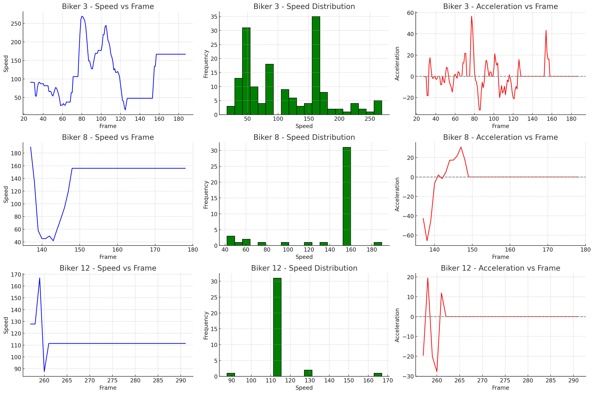
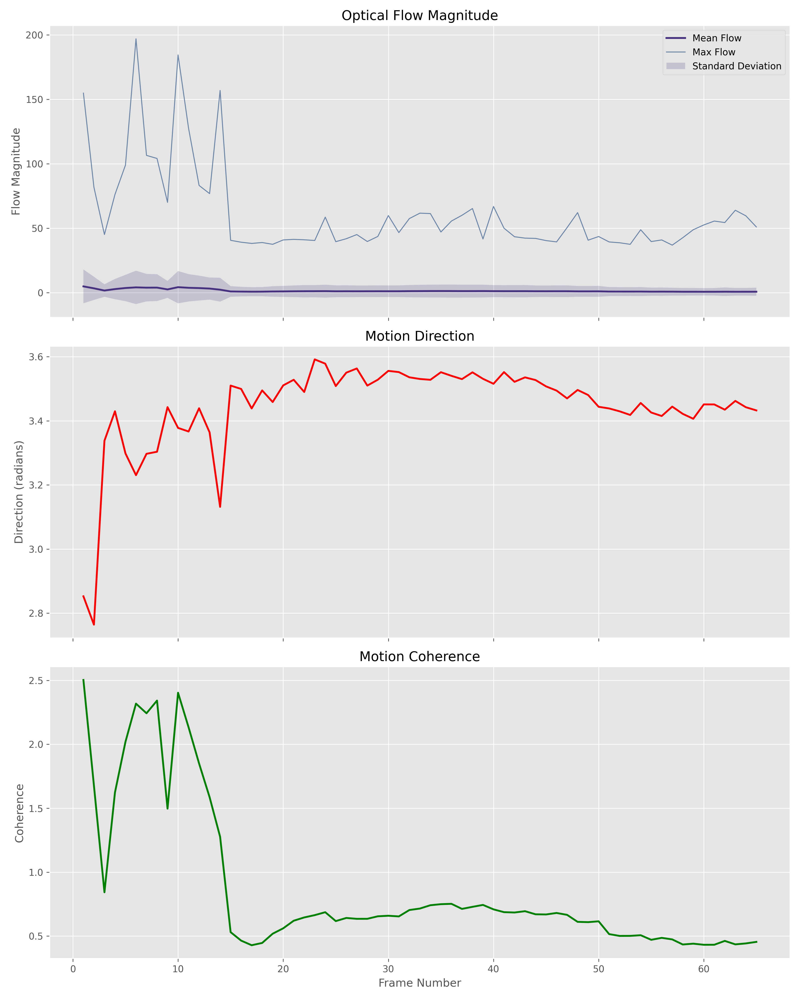
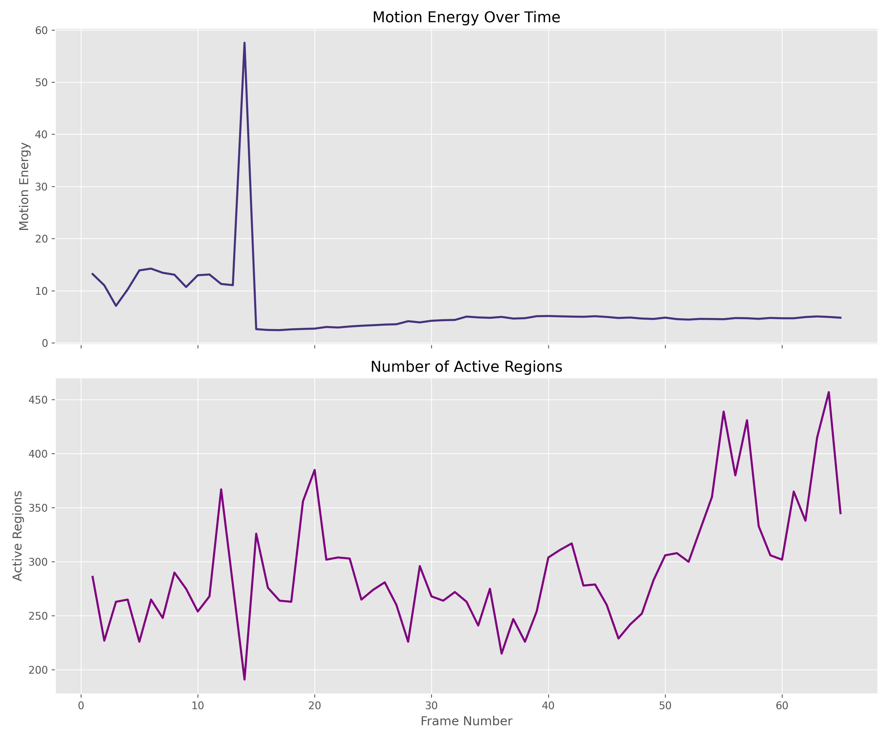
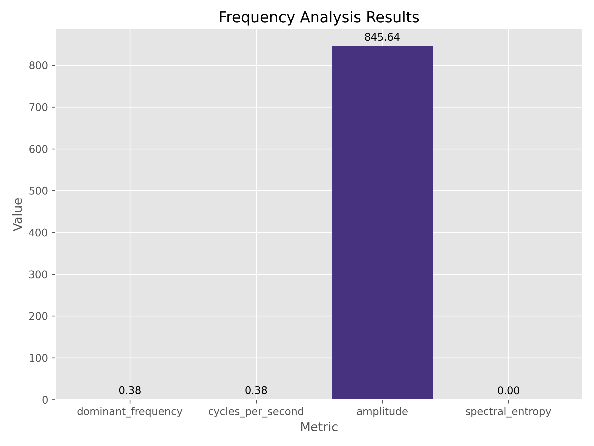
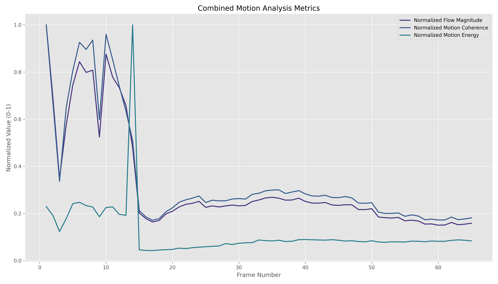

<p align="center">
  
</p>

<h1 align="center">Vibrio</h1>
<p align="center"><em>Computer Vision Framework for Human Motion Analysis</em></p>

## Overview

Vibrio is a computer vision framework designed to analyze human motion in video footage. The framework implements a modular pipeline approach for detecting, tracking, and analyzing humans in videos, with specific focus on motion analysis through multiple optical methods.

## Technical Architecture

The Vibrio framework is structured as a modular pipeline with the following components:

```
┌───────────────┐      ┌───────────────┐      ┌───────────────┐      ┌───────────────┐
│  Human        │      │  Object       │      │  Speed        │      │  Physics      │
│  Detection    ├─────►│  Tracking     ├─────►│  Estimation   ├─────►│  Verification │
└───────────────┘      └───────────────┘      └───────────────┘      └───────────────┘
                                                                             │
        ┌────────────────────────────────────────────────────────────────────┘
        │
        ▼
┌───────────────┐      ┌───────────────┐      ┌───────────────┐
│  Optical      │      │  Pose         │      │  Result       │
│  Analysis     │◄─────┤  Detection    │      │  Visualization│
└───────────────┘      └───────────────┘      └───────────────┘
```

### Data Flow

The framework processes videos through sequential stages:

1. **Input**: Video frames are extracted and processed one by one
2. **Detection**: Humans are detected in each frame using deep learning models
3. **Tracking**: Detected humans are tracked across frames to maintain identity
4. **Analysis**: Multiple analyses are performed on tracked objects:
   - Speed estimation based on positional changes
   - Physics-based verification of calculated speeds
   - Optical analysis for detailed motion characteristics
   - Optional pose detection for biomechanical analysis
5. **Output**: Results are saved to disk and can be visualized

## Core Components

### 1. Human Detection (`modules/detector.py`)

The detection module uses YOLOv8, an object detection network, specifically configured to identify humans in video frames.

**Technical Details:**
- **Model**: YOLOv8 (nano or larger variants)
- **Input**: RGB image frame
- **Output**: List of bounding boxes with confidence scores
- **Performance**: 
  - Inference speed: ~30-100 FPS depending on hardware and model size
  - Detection threshold configurable (default: 0.5)

**Implementation:**

```python
detector = HumanDetector(
    model_path="yolov8n.pt",  # Smaller model for speed
    conf_threshold=0.5,
    device="cuda:0"  # Uses GPU if available
)
detections = detector.detect(frame)
```

### 2. Object Tracking (`modules/tracker.py`)

The tracking module implements a Kalman filter-based tracking system to maintain the identity of detected objects across frames.

**Technical Details:**
- **Algorithm**: Kalman filter with Hungarian algorithm for assignment
- **State Space Model**: Position, velocity, and bounding box dimensions
- **Assignment**: IoU (Intersection over Union) based matching

**Mathematical Foundation:**

State representation in the Kalman filter:
$$x = [c_x, c_y, w, h, \dot{c_x}, \dot{c_y}, \dot{s}]^T$$

Where:
- $c_x, c_y$ are the center coordinates of the bounding box
- $w, h$ are the width and height of the bounding box
- $\dot{c_x}, \dot{c_y}$ are the velocity components
- $\dot{s}$ is the scale change rate

**Implementation:**
```python
tracker = HumanTracker(
    max_age=30,       # Maximum frames to keep a track without matching
    min_hits=3,       # Minimum detections before track is established
    iou_threshold=0.3 # Threshold for detection-track association
)
tracks = tracker.update(detections, frame_idx)
```

### 3. Speed Estimation (`modules/speed_estimator.py`)

The speed estimator calculates the velocity of tracked objects based on positional changes between frames.

**Technical Details:**
- **Input**: Track history with positions and current frame index
- **Method**: Pixel displacement with optional calibration
- **Output**: Estimated speed in km/h

**Mathematical Foundation:**

The basic speed calculation follows:
$$v = \frac{\Delta d}{\Delta t} = \frac{d_{pixels} \cdot r_{calibration}}{\Delta frames / fps}$$

Where:
- $v$ is velocity in m/s (converted to km/h)
- $d_{pixels}$ is distance in pixels
- $r_{calibration}$ is the pixel-to-meter ratio
- $fps$ is frames per second of the video

For uncalibrated video, a default pixel-to-meter ratio is used, which may introduce systematic error in the absolute speed values.

**Implementation:**
```python
speed_estimator = SpeedEstimator(calibration=None)
tracks = speed_estimator.estimate(tracks, frame_idx=frame_idx, fps=video_fps)
```

### 4. Physics Verification (`modules/physics_verifier.py`)

The physics verifier applies domain-specific constraints to validate speed estimates.

**Technical Details:**
- **Method**: Rule-based verification using physical constraints
- **Context sensitivity**: Different constraints for different activities

**Constraint Examples:**

| Activity | Max Speed | Max Acceleration | Notes |
|----------|-----------|------------------|-------|
| Walking  | 7 km/h    | 2 m/s²           | Normal walking pace |
| Running  | 45 km/h   | 10 m/s²          | Elite sprinters |
| Cycling  | 80 km/h   | 4 m/s²           | Racing cyclists on flat terrain |

**Implementation:**
```python
verifier = PhysicsVerifier(context='general')
tracks = verifier.verify(tracks)
```

### 5. Optical Analysis (`modules/optical_analysis.py`)

The optical analyzer implements advanced methods for detailed motion analysis using computer vision techniques.

**Implemented Methods:**

1. **Optical Flow Analysis**
   - **Algorithm**: Farneback dense optical flow
   - **Outputs**: Motion magnitude, direction, coherence
   - **Applications**: Detecting direction and intensity of movement

2. **Motion Energy Analysis**
   - **Algorithm**: Motion History Images (MHI)
   - **Outputs**: Motion energy, active regions, temporal signatures
   - **Applications**: Activity detection, motion segmentation

3. **Neuromorphic Camera Simulation**
   - **Algorithm**: Event-based threshold crossing detection
   - **Outputs**: Events density, polarity ratio
   - **Applications**: High temporal precision motion detection

4. **Texture and Gradient Analysis**
   - **Algorithm**: Gabor filters and Local Binary Patterns
   - **Outputs**: Texture scores, dominant orientations
   - **Applications**: Surface and micro-motion detection

5. **Shadow and Illumination Analysis**
   - **Algorithm**: HSV-based shadow detection
   - **Outputs**: Shadow area, movement direction
   - **Applications**: Additional motion cues from lighting changes

**Mathematical Foundations:**

For optical flow, the algorithm solves:
$$I(x,y,t) = I(x+\Delta x, y+\Delta y, t+\Delta t)$$

Through Taylor expansion and additional constraints, this yields a flow field:
$$\nabla I \cdot \mathbf{v} + I_t = 0$$

Where:
- $\nabla I$ is the spatial gradient
- $\mathbf{v}$ is the velocity vector
- $I_t$ is the temporal gradient

**Implementation:**
```python
analyzer = OpticalAnalyzer(output_dir='results/optical_analysis')
results = analyzer.analyze_video(
    video_path,
    methods=['optical_flow', 'motion_energy']
)
```

## Practical Usage

### Basic Command Line Usage

```bash
# Basic analysis of a video
python main.py --input video.mp4 --output results/

# Batch processing of multiple videos
python batch_analyze.py --input_dir videos/ --output_dir results/batch --use_optical

# Analysis of results
python analyze_results.py --results_dir results/batch
```

### Optical Analysis Options

```bash
# Analyze with specific optical methods
python batch_analyze.py --input_dir videos/ --use_optical --optical_methods optical_flow motion_energy

# Perform dedicated optical analysis
python analyze_optical.py --video_path video.mp4 --methods optical_flow neuromorphic texture_analysis
```

### Configuration Options

| Parameter | Description | Default |
|-----------|-------------|---------|
| `--detector` | Human detector model | yolov8n |
| `--confidence` | Detection confidence threshold | 0.4 |
| `--use_pose` | Enable pose estimation | False |
| `--use_optical` | Enable optical analysis | False |
| `--device` | Processing device | cuda:0 or cpu |

## Results Analysis

Vibrio generates several types of outputs that can be analyzed:

1. **Annotated Videos**
   - Bounding boxes around detected humans
   - Track IDs and estimated speeds
   - Visual overlays of optical analysis results

2. **Quantitative Data**
   - CSV files with frame-by-frame tracking data
   - Speed profiles for each tracked object
   - Optical analysis metrics time series

3. **Visualizations**
   - Speed distribution graphs
   - Motion heatmaps
   - Comparative analysis between subjects

### Example Output: Speed Analysis



The plot above shows an example speed profile from tracking analysis, demonstrating the acceleration, steady-state, and deceleration phases of human motion. Statistical analysis of such profiles enables quantitative comparison between different subjects or activities.

### Example Output: Optical Flow


Optical flow analysis reveals motion patterns not immediately obvious in the raw video. The color-coded visualization shows direction (hue) and magnitude (saturation) of motion, providing insights into the distribution and coherence of movement.

## Analysis Results: Motion Visualization

The following visualizations demonstrate the framework's capabilities on real-world footage:

### Detailed Analysis: Downhill Mountain Biking

For the downhill mountain biking footage, we performed a comprehensive multi-method analysis, combining visual annotations, optical analysis methods, and quantitative metrics:

#### 1. Activity Tracking and Annotation


#### 2. Optical Flow Analysis


The optical flow analysis reveals detailed motion patterns:



The plots show:
- **Top**: Flow magnitude (mean, max, and standard deviation)
- **Middle**: Motion direction in radians
- **Bottom**: Motion coherence indicating coordinated movement

#### 3. Motion Energy Analysis


The motion energy metrics provide insights into activity intensity:



The plots demonstrate:
- **Top**: Motion energy over time, showing intensity variations
- **Bottom**: Number of active regions, correlating with movement complexity

#### 4. Frequency Analysis


The frequency domain analysis quantifies motion patterns:



This chart shows dominant motion frequencies and amplitudes in the rider's movement.

#### 5. Combined Analysis


This visualization shows the normalized metrics from different analysis methods, allowing direct comparison between optical flow, motion coherence, and energy measurements, highlighting how these metrics correlate during different motion phases.

### Analysis of Different Activities

Vibrio has been tested on a variety of high-speed human activities, demonstrating its versatility:

#### Alpine Skiing


**Key Findings**: Smooth acceleration phases followed by high-G turns with distinctive weight shifts. Analysis detected characteristic patterns in the skier's weight distribution during turns and rapid direction changes.

#### Speed Skiing


**Key Findings**: Extreme speeds (100+ km/h) with minimal lateral movement and tightly controlled body position. Optical analysis revealed exceptionally high motion coherence values indicating the precise technique required at these speeds.

These visualizations demonstrate how multiple optical methods can extract rich information about motion characteristics that go beyond simple speed measurements, revealing the biomechanical aspects of human performance across different activities.

## Performance Considerations

The framework's performance depends on several factors:

1. **Hardware Requirements**
   - CPU-only: Analysis runs at reduced speed (5-10 FPS)
   - GPU-accelerated: Real-time or faster analysis possible (30+ FPS)

2. **Model Selection Trade-offs**
   - Smaller models (yolov8n): Faster but less accurate detection
   - Larger models (yolov8x): More accurate but slower detection

3. **Processing Resolution**
   - Higher resolution: Better accuracy but slower processing
   - Lower resolution: Faster processing but reduced accuracy

## Limitations and Considerations

1. **Speed Estimation Accuracy**
   - Without camera calibration, absolute speed values are approximate
   - Best used for relative comparisons between subjects in the same video

2. **Tracking Challenges**
   - Performance degrades with occlusions and crowded scenes
   - Rapid camera movement can disrupt tracking continuity

3. **Optical Analysis Requirements**
   - Some methods require minimum video quality and resolution
   - Performance is scene-dependent (lighting, background complexity)

## References

1. Jocher, G., Chaurasia, A., & Qiu, J. (2023). YOLO by Ultralytics [Computer software]. https://github.com/ultralytics/ultralytics

2. Welch, G., & Bishop, G. (1995). An introduction to the Kalman filter. University of North Carolina at Chapel Hill, Department of Computer Science.

3. Farnebäck, G. (2003). Two-frame motion estimation based on polynomial expansion. In Scandinavian conference on Image analysis (pp. 363-370).

4. Bradski, G., & Kaehler, A. (2008). Learning OpenCV: Computer vision with the OpenCV library. O'Reilly Media, Inc.

5. Kuhn, H. W. (1955). The Hungarian method for the assignment problem. Naval research logistics quarterly, 2(1‐2), 83-97.

## License

This project is licensed under the MIT License - see the LICENSE file for details. 