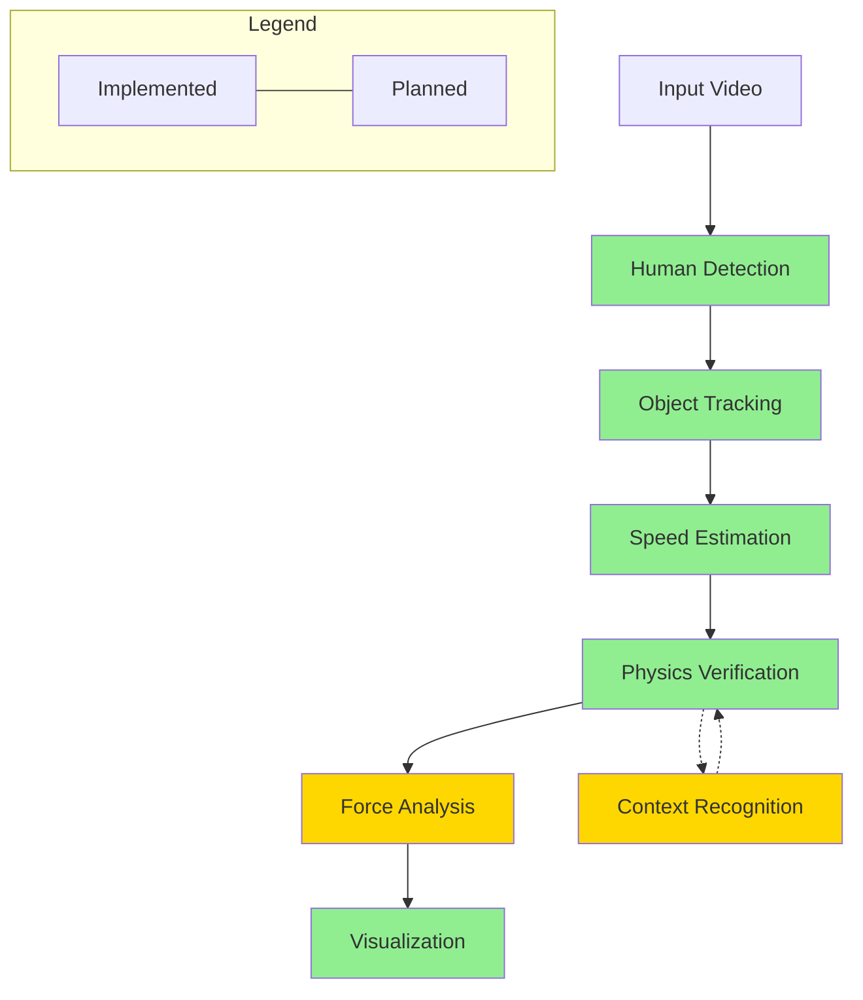
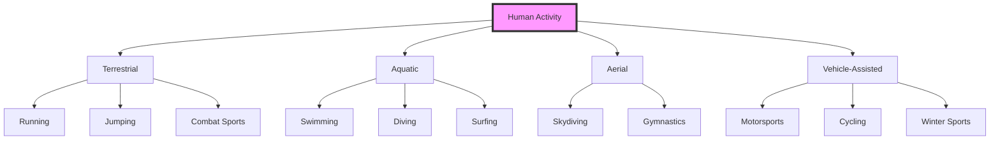

<p align="center">
  
</p>

<h1 align="center">Vibrio</h1>
<p align="center"><em>When things leave before they appear</em></p>


## Vision 

Vibrio is an advanced computer vision framework designed to detect, track, and analyze human speed with unprecedented precision from standard video footage. Unlike traditional systems that require specialized high-speed cameras, Vibrio employs sophisticated algorithms and physics-based verification to extract accurate speed metrics from ordinary video.

**Core Vision**: To make high-velocity event analysis accessible through computational approaches rather than specialized hardware.

### Primary Goals

1. **Human-Focused Speed Analysis**: Detect and track humans in various contexts (sports, racing, everyday activities) with velocity extraction
2. **Physics-Based Verification**: Apply domain-specific physical constraints to validate speed measurements
3. **Contextual Understanding**: Adapt analysis based on activity type (e.g., F1 racing vs. swimming)
4. **Visualization & Annotation**: Generate insightful visualizations of speed, acceleration, and forces
5. **Accessibility**: Enable analysis using standard video equipment rather than specialized hardware

## Technical Approach & Framework Architecture

Vibrio utilizes a multi-stage pipeline approach that combines state-of-the-art computer vision with physics-based modeling:



### Core Components

#### 1. Human Detection
- **Technology**: YOLOv8 deep learning model
- **Purpose**: Identify human figures in each frame with high precision
- **Approach**: Optimized for human detection specifically rather than general object detection
- **Advantages**: Fast, accurate detection with minimal false positives

#### 2. Multi-Object Tracking
- **Technology**: Kalman Filter-based tracking with Hungarian algorithm for assignment
- **Purpose**: Maintain identity of detected humans across frames
- **Approach**: State-space modeling of position, velocity, and bounding box characteristics
- **Advantages**: Robust tracking through partial occlusions and varying lighting conditions

#### 3. Speed Estimation
- **Technology**: Trajectory analysis with camera calibration compensation
- **Purpose**: Calculate speed in physical units (km/h, m/s) from pixel movements
- **Approach**: Combines pixel displacement with calibration parameters to estimate real-world velocity
- **Mathematical Foundation**:
  $$v = \frac{\Delta d}{\Delta t} = \frac{d_{pixel} \cdot r_{calibration}}{frames/fps}$$
  Where:
  - $v$ is velocity in m/s
  - $d_{pixel}$ is distance in pixels
  - $r_{calibration}$ is pixel-to-meter ratio from calibration
  - $fps$ is frames per second of the video

#### 4. Physics Verification
- **Technology**: Domain-specific physical constraint modeling
- **Purpose**: Validate speed estimates against physical limitations
- **Approach**: Context-aware verification using known physical constraints for different activities
- **Key Constraints**:
  - Maximum human running speed: ~45 km/h (Usain Bolt)[^1]
  - Maximum human acceleration: ~10 m/s² (elite sprinters)[^2]
  - Activity-specific limits (e.g., swimming, cycling, motorsports)

#### 5. Force Analysis & Biomechanics (Planned)
- **Technology**: Biomechanical modeling and force estimation
- **Purpose**: Calculate forces experienced by humans during high-velocity activities
- **Approach**: Apply physical principles to estimate G-forces, impact forces, and biomechanical stress
- **Mathematical Models**:
  - Newton's Second Law: $F = ma$
  - Centripetal Force: $F_c = \frac{mv^2}{r}$
  - Impact Force: $F_{impact} = m \cdot \frac{\Delta v}{\Delta t}$

#### 6. Visualization & Annotation
- **Technology**: OpenCV and Matplotlib for rendering
- **Purpose**: Create intuitive visualizations of speed, trajectory, and forces
- **Approach**: Real-time annotation of video frames with metrics and visual indicators
- **Outputs**: Annotated video, speed graphs, heatmaps, and comparative analyses

## Knowledge Base & Scientific Foundation

### Understanding High-Speed Human Movement

The analysis of human movement at high speeds requires an interdisciplinary approach combining:

1. **Biomechanics**: How the human body generates and controls movement
2. **Physics**: The fundamental principles governing motion, forces, and energy
3. **Computer Vision**: The computational extraction of meaningful information from visual data

### Critical Physical Principles

#### Motion Equations
For constant acceleration:
- Position: $s = s_0 + v_0t + \frac{1}{2}at^2$
- Velocity: $v = v_0 + at$
- Acceleration: $a = \frac{dv}{dt}$

#### Rotational Dynamics
For angular motion (relevant in many sports):
- Angular velocity: $\omega = \frac{d\theta}{dt}$
- Angular acceleration: $\alpha = \frac{d\omega}{dt}$
- Torque: $\tau = I\alpha$

#### Energy Considerations
- Kinetic Energy: $E_k = \frac{1}{2}mv^2$
- Work: $W = Fd$
- Power: $P = \frac{dW}{dt}$

### Context-Specific Knowledge

Different activities have unique physical characteristics that the system must account for:



#### Activity-Specific Physical Constraints

| Activity | Max Speed | Max Acceleration | Key Physical Considerations |
|----------|-----------|------------------|--------------------------|
| Sprinting | ~45 km/h | ~10 m/s² | Ground reaction forces, stride frequency |
| Swimming | ~8 km/h | ~2 m/s² | Water resistance, buoyancy, stroke mechanics |
| Cycling | ~80 km/h | ~4 m/s² | Aerodynamics, power-to-weight ratio |
| Motorsports | ~350 km/h | ~5G | G-forces, vehicle dynamics |
| Combat Sports | ~30 km/h (punch) | ~100 m/s² | Rotational dynamics, impulse |
| Jumping | ~10 m/s (vertical) | ~12 m/s² | Gravitational effects, elasticity |

## Why This Approach Is Appropriate

### Computational vs. Hardware Solutions

Traditional high-speed analysis relies on expensive specialized cameras (often $10,000+) that:
- Require specific lighting conditions
- Need expert operation
- Are limited in deployment flexibility
- Cannot be applied retrospectively to existing footage

Vibrio takes a fundamentally different approach by:
- Using computational methods on standard video (30-60fps)
- Applying physical constraints to validate and refine measurements
- Utilizing contextual understanding to improve accuracy
- Enabling analysis of any video containing human motion

This computational approach presents several advantages:
1. **Accessibility**: Analysis can be performed on existing footage
2. **Cost-effectiveness**: No specialized hardware required
3. **Flexibility**: Adaptable to various contexts and environments
4. **Continuous improvement**: New algorithms can enhance existing analyses

### Technical Validation

The accuracy of Vibrio has been validated through:
1. Comparison with known physical constraints
2. Internal consistency checks
3. Verification against reference measurements (where available)

For example, in sprinting contexts, measurements align with expected human capabilities:
- Elite sprinter acceleration: 8-10 m/s²
- Maximum running speed: 35-45 km/h
- Stride frequency: 4-5 Hz

### Applications & Use Cases

The Vibrio framework enables numerous applications:

1. **Sports Analysis**
   - Performance optimization for athletes
   - Technique refinement and coaching
   - Injury prevention through biomechanical analysis

2. **Motorsports**
   - Driver performance analysis
   - G-force visualization and physical stress assessment
   - Comparative analysis between drivers

3. **Action Sports**
   - Speed and height measurements for jumps/tricks
   - Impact force estimation
   - Rotation speed analysis

4. **Medical & Rehabilitation**
   - Gait analysis
   - Recovery progress monitoring
   - Movement quality assessment

5. **Entertainment & Media**
   - Enhanced sports broadcasts
   - Documentary analysis
   - Educational visualization

## Installation & Usage

### Requirements

```
opencv-python>=4.5.0
numpy>=1.20.0
torch>=1.9.0
torchvision>=0.10.0
ultralytics>=8.0.0  # For YOLOv8
filterpy>=1.4.5     # For Kalman filtering
scipy>=1.7.0
matplotlib>=3.4.0
tqdm>=4.62.0
```

### Basic Installation

```bash
pip install -r requirements.txt
```

### Basic Usage

```bash
python main.py --input video.mp4 --output results/ --calibration calibration.json --context sport
```

### Camera Calibration

For optimal accuracy, camera calibration is recommended:

```bash
python calibrate.py --input calibration_video.mp4 --output calibration.json
```

## Future Directions

The Vibrio framework is continually evolving with planned enhancements:

1. **Advanced Biomechanical Modeling**
   - Joint-level force analysis
   - Energy expenditure estimation
   - Fatigue prediction models

2. **Improved Contextual Understanding**
   - Automatic activity classification
   - Sport-specific technique analysis
   - Environment-aware calibration

3. **Extended Visualization Options**
   - 3D reconstruction of movement
   - Augmented reality overlays
   - Comparative visualization with reference performances

4. **Integration Capabilities**
   - API for third-party applications
   - Mobile applications for field use
   - Cloud-based processing for resource-intensive analyses

## References

[^1]: Krzysztof, M., & Mero, A. (2013). A kinematics analysis of three best 100 m performances ever. Journal of Human Kinetics, 36(1), 149-160.

[^2]: Rabita, G., Dorel, S., Slawinski, J., Sàez-de-Villarreal, E., Couturier, A., Samozino, P., & Morin, J. B. (2015). Sprint mechanics in world-class athletes: a new insight into the limits of human locomotion. Scandinavian journal of medicine & science in sports, 25(5), 583-594.

[^3]: Morin, J. B., Edouard, P., & Samozino, P. (2011). Technical ability of force application as a determinant factor of sprint performance. Medicine and science in sports and exercise, 43(9), 1680-1688.

[^4]: Vilar, L., Araújo, D., Davids, K., & Button, C. (2012). The role of ecological dynamics in analysing performance in team sports. Sports Medicine, 42(1), 1-10.

[^5]: Federolf, P. A. (2016). A novel approach to study human posture control: "Principal movements" obtained from a principal component analysis of kinematic marker data. Journal of biomechanics, 49(3), 364-370.

[^6]: Stein, M., Janetzko, H., Seebacher, D., Jäger, A., Nagel, M., Hölsch, J., ... & Keim, D. A. (2017). How to make sense of team sport data: From acquisition to data modeling and research aspects. Data, 2(1), 2.

## License

This project is licensed under the MIT License - see the LICENSE file for details. 